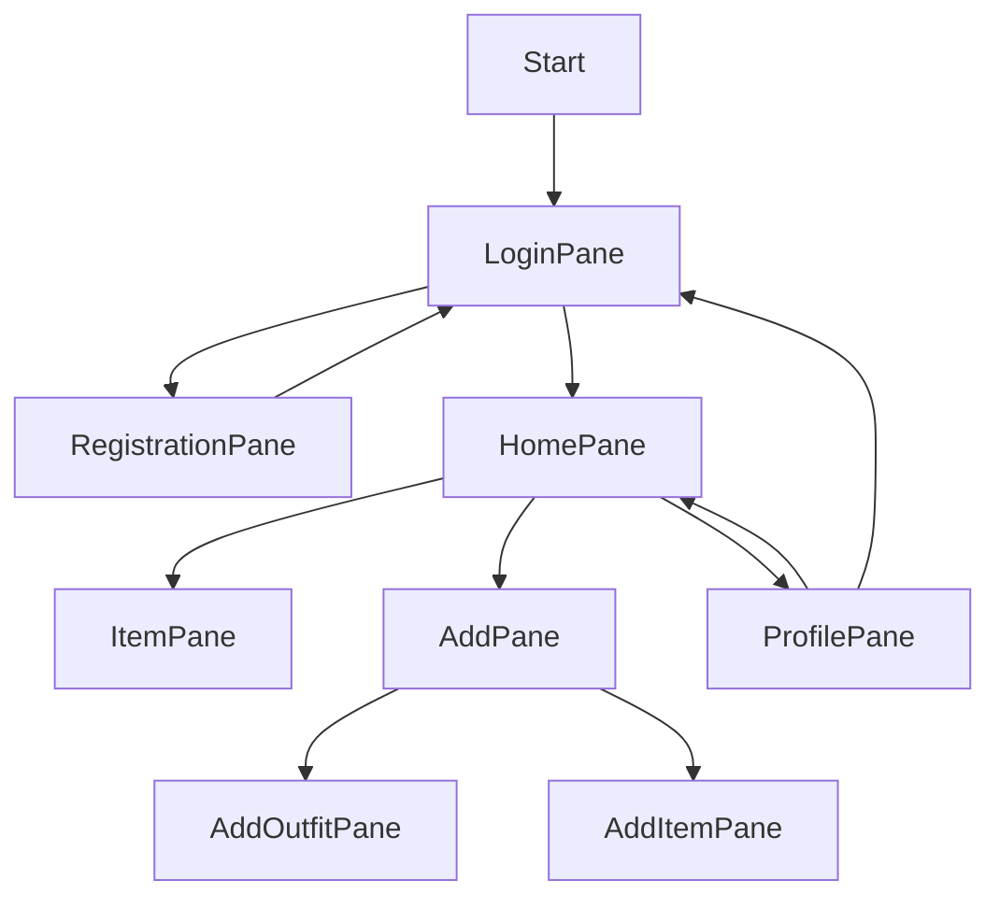
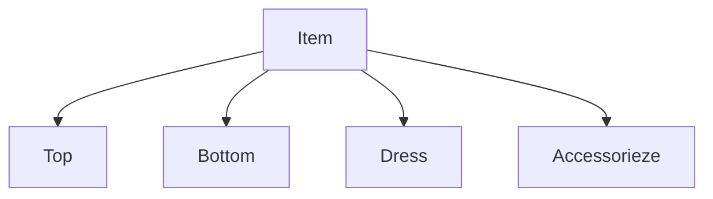
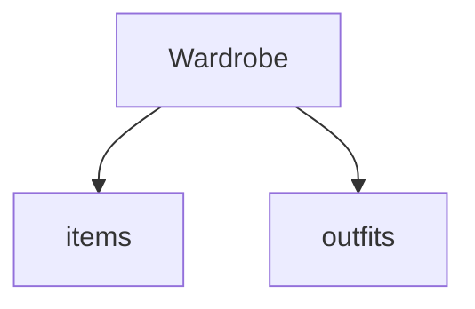
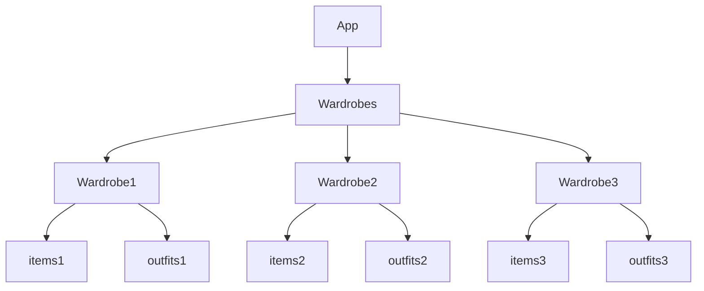

# My Wardrobe - Organize your wardrobe

## 1. About

The target of our project was to developed a app to create a digital version of our closet to have it always with us and to solve the problem of all people "I have nothing to wear !". This app help the user organize all of the pieces of clothing present in his/hers wardrobe.
The menu bar on the top help to navigate the app, in addition the filters of the research allow the user to find the exact item he/she is looking for.

### 1.1. Demo

Add a link to a demo of your project.

## 2. Authors

This project was created by:

* Avezzù Irene
* Sacchetto Josephine

## 3. Usage

Describe how to compile, package, and run your project here.

To build the project, run:

```shell
mvn package
```

To do X, run:

```
mvn abc
```

## 4. Implementation

...

### 4.1. Architectural Overview

We divided our idea in blocks structuring our application in classes.

FRONT-END:
The Start class represents the starting point for our application, it creates and item of LoginPane which, based on the user actions, can lead to a RegisterPane (where the user can create a new account and then being rediected to the LoginPane) or the HomePane. The HomePane allows the user to filter the items (ItemPane), add new items/outfits (AddPane, AddOutfitPane, AddItemPane) or go to its Profile (ProfilePane).



BACK-END:
The Item class represent the base element for the wardrobe. Top, Bottom, Dress and Accessorieze exteds it.

The Wardrobe class simulates a user wardrobes, contains a collection of items and outfits.

The App class is a collection of wardrobes, it provides method that support the connection to the GUI.


### 4.2. Third-Party Libraries

We did not use third party libraries.

### 4.3. Programming Techniques

List and explain how you used the 10 programming techniques required for this project.
1.   **GUI:** We used JavaFX to realize the GUI
2.   **Logging:** each user has its own wardrobe so creating an account was a necessities and to allow more users on the seme devices logging becomed foundamental
3.   **I/O file:** we used file to obviate the absence of database, we used external text files to "remember" the past uses of the application. Files are also used to import items in a faster way compared to the manual option. In addition, file input are used to assign to each item and outfit a picture
4.   **Try/catch:** try and catch were necessary when working with I/O file  
5.   **Overriding:** the toString of the class Item and Outfit has been overrided
6.   **Overloading:** we used multiple constructor for the Item obj based on which parameters were passed
7.   **Serialization:** we used serialization to simulate a database, the application is saved in a json file and reload everytime the app is open
8.   **Deserialization:** we used deserialization to allow our application to creates items objects from a json file and to load the application from its json file used to simulate a database
9.   **Varargs:** in AppPannel (per caricare gli oggetti)??
10.  **Generic classes:** ??
11.  **Custom exceptions:** ??

**Abstract classes: abstract classes were used in the realization of the Item class wich represent a general item but no item that is not a top/bottom/accesorize can be created**


### 4.4. Tests

To assert all action of our application warkes in the correct way we worked on both white-box testing and black-box testing.

**Black-box testing:** to make sure the application worked we asked some of our friends (both computer scienze experts and non-experts) to test it and based on their feedbacks we fixed the portion of the code that were not functioning in the correct way.

**White-box testing:**

## 5. Experience

### 5.1. Overall Experience

The idea for this project came to us pretty easly but the realization did not come as easy. We wanted to creat something that could be actual useful. We intially struggled with the impossibility of using a database. The choice between a web app and a desktop us took us some times but at the end we choose a desktop app because it would be easier to upload picture of items for the users.
Even if we had never collaborated to a project we divided in an optimal way the implementations needed of the app. On the other hand we did not manage the time given in the best way but by the end we were able to complete the assigned task.

### 5.2. Division of Responsibilities

Description of the roles and responsibilities that each member had in this project:

- **Irene Avezzù:** I was mainly responsible for the implementation of the backend of the app
- **Josephine Sacchetto:** I was mainly responsible for the implementation of the frontend of the app
- We worked separately in the actual realisazion of the code but the idea for both the structure of the backend and the graphic of the frontend were discussed and outlined together. We developed together the connection between front and backend. We also worked together when extra materials were needed, such as images or researches on structure (e.g. object of JavaFx). We collaborated for the realization of the test suits.

### 5.3. Main Challenges

Elaborate on the main challenges each group member faced throughout the project and how they were surpassed.

- **Irene Avezzù:** The most difficult aspect in this project for me was to implement the test suits because I still struggle in the creation of a complete suit of test.
- **Josephine Sacchetto:** The most difficult aspect in this project for me was to implement xxx. The reason was X so I had to do Y and I achived Z.

### 5.4. Learning Outcomes

Describe what you learned with this project.

- **Irene Avezzù** I learned with Gson developing serializaion and deserialization method.
- **Josephine Sacchetto:** I learned how to implement the design pattern. `abc`


